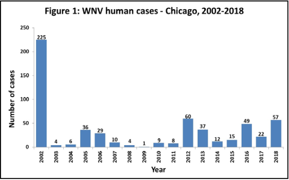
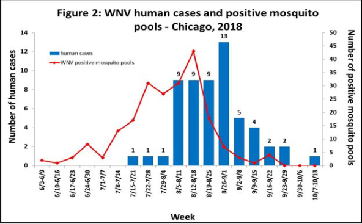

# General Assembly DSI-18 Project 4

## West Nile Virus Prediction in the City of Chicago

Alex | Elliot | Mak | Robby

### Problem Statement

As data scientists from a data consultancy firm engaged by the Chicago Department of Public Health, our goal is to build a fully predictive model to be used for proactive mosquito management. The classification model will predict whether WNV-positive mosquitoes are found in a particular trap, and will be evaluated based on its AUC score as well as recall score.

The effects of building this model are two-fold:

1. Saving costs in terms of vector management and spraying specific traps predicted by our model which will be more effective and targeted. This helps the department to stay within their budget.

2. The proactive and predictive approach will prevent WNV infections from reaching outbreak levels. The benefits accrued for this is the cost savings by preventing human productivity loss and medical treatment costs that might otherwise be incurred from WNV infections.

### Executive Summary

**Background** 
West Nile Virus (WNV) is the leading cause of mosquito-borne disease in the continental United States. It is most commonly spread to people by the bite of an infected mosquito after it has fed off an infected bird. Cases of WNV commonly occur during the mosquito season, starting in the summer and continuing through fall. 1 in 5 people who are infected develop a fever and other symptoms. **In more severe cases, about 1 out of 150 infected people develop a serious, sometimes fatal, illness.** Unchecked mosquito populations leading to WNV would also lead to financial loss, adjusting for an overall median, a case of WNV could cost in a range of USD 6,888 - 47,745. **Thus, it is both ethically and fiscally responsible to create measures to keep overall mosquito populations in check.**  

In 2002, an epidemic of WNV infections was detected in Chicago, and by 2004, the Chicago Department of Public Health (CDPH) had set up a surveillance and control system, trapping mosquitos to be tested for the presence of WNV. While the most serious outbreak remains to be in 2002, other years have also reached high number of human cases. In fact, 2005, 2012, 2013, 2016, and 2018 recorded more than 30 human cases. Furthermore, the summer months were shown to be the most active for WNV human cases, and wnv-positive mosquito pools.  

**Issue** 
States across the US have typically depended on a reactionary approach to vector and WNV management to control and respond to mosquito and WNV outbreaks. However, this usually is less effective as the outbreak would have already occurred and or advanced to its late phase. Additionally, the city budget is limited to USD 36 million in 2019 for CDPH, where vector management comes under. Assuming 5-10% of this is allocated to vector management, Chicago's budget comes to about USD 3 million, a very limited amount that needs to be put towards a very important, yet typically expensive use.
 

**Proposal** 
Instead of a reactionary approach, we propose a proactive approach to vector and WNV management that has gained traction recently across the States. Such an approach requires less expense overlay and prevents vector and WNV infections from spiraling out of control. 
 

One of the key tools to complement a proactive approach is **predictive analytics on possible traps that will contain WNV-infected mosquitoes** (i.e. the area may contain a significant population of WNV-positive mosquitoes, which may then lead to a potential WNV outbreak). The model will serve as a core tool in the proactive and predictive approach to vector management. 

### Conclusions

Our final `VotingClassifier` model, comprises of an ensemble of `GradientBoostingClassifier`, `AdaBoostClassifier` and `XGBClassifier`, is fully predictive based on weather features which can be forecasted beforehand. 
 

The base classifier model has a ROC-AUC of 0.751 based on kaggle scoring (0.86 based on validation set) and a recall score of 0.74, while our fully predictive model has a ROC-AUC of 0.718 on kaggle (0.86 based on validation set) and an identical recall score of 0.74. 
 

We have exchanged a slight drop in ROC-AUC with a highly predictive model and we forecast this model is able to **deliver annual benefits of USD 1.7 million** based on reducing costs by pinpointing traps that need to be sprayed beforehand as a preventive approach as well as assumed benefits from a 50% reduction in the overall wnv infection rates.    

### Data Dictionary
| Features                | Description                                                                                                                                  | Data Type|
| ----------------------- | -------------------------------------------------------------------------------------------------------------------------------------------- |----------|
| wnvpresent              | Target variable. Whether West Nile Virus was present in these mosquitos. 1 means WNV is present, and 0 means not present                     |*int*     |
| date                    | Date that the WNV test is performed                                                                                                          |*datetime*|
| maxtemp                 | Maximum temperature during the day (in Fahrenheit)                                                                                           |*int*     |
| mintemp                 | Minimum temperature during the day (in Fahrenheit)                                                                                           |*int*     |
| avgtemp                 | Average temperature during the day (in Fahrenheit)                                                                                           |*float*   |
| dewpoint                | Average dewpoint during the day (the atmospheric temperature below which water droplets begin to condense and dew can form)                  |*float*   |
| wetbulb                 | Temperature read by a thermometer covered in water-soaked cloth (wet-bulb thermometer) over which air is passed                              |*float*   |
| stnpressure             | Average station pressure                                                                                                                     |*float*   |
| avgspeed                | Average speed in miles per hour                                                                                                              |*float*   |
| daylength               | daylength calculated as time from sunrise to sunset                                                                                          |*float*   |
| precipitation           | Total precipitation in inches                                                                                                                |*float*   |
| maxtemp\_roll\_7        | 7-day rolling average max temp                                                                                                               |*float*   |
| mintemp\_roll\_7        | 7-day rolling average min temp                                                                                                               |*float*   |
| avgtemp\_roll\_7        | 7-day rolling average avg temp                                                                                                               |*float*   |
| dewpoint\_roll\_7       | 7-day rolling average dewpoint                                                                                                               |*float*   |
| wetbulb\_roll\_7        | 7-day rolling average wetbulb                                                                                                                |*float*   |
| stnpressure\_roll\_7    | 7-day rolling average station pressure                                                                                                       |*float*   |
| avgspeed\_roll\_7       | 7-day rolling average average speed                                                                                                          |*float*   |
| daylength\_roll\_7      | 7-day rolling average daylength                                                                                                              |*float*   |
| precipitation\_roll\_7  | 7-day rolling average precipitation                                                                                                          |*float*   |
| maxtemp\_roll\_14       | 14-day rolling average max temp                                                                                                              |*float*   |
| mintemp\_roll\_14       | 14-day rolling average min temp                                                                                                              |*float*   |
| avgtemp\_roll\_14       | 14-day rolling average avg temp                                                                                                              |*float*   |
| dewpoint\_roll\_14      | 14-day rolling average dewpoint                                                                                                              |*float*   |
| wetbulb\_roll\_14       | 14-day rolling average wetbulb                                                                                                               |*float*   |
| stnpressure\_roll\_14   | 14-day rolling average station pressure                                                                                                      |*float*   |
| avgspeed\_roll\_14      | 14-day rolling average average speed                                                                                                         |*float*   |
| daylength\_roll\_14     | 14-day rolling average daylength                                                                                                             |*float*   |
| precipitation\_roll\_14 | 14-day rolling average precipitation                                                                                                         |*float*   |
| species\_wnv\_species   | binary feature where 1 = wnv\_species mosquitoes 0 = non\_wnv\_mosquitoes                                                                    |*int*     |
| trap\_wnv\_traps        | binary feature where 1 = traps that have historically had wnv mosquitoes found, 0 = traps that historically do not have wnv mosquitoes found |*int*     |
| month\_peak             | binary feature where 1 = August and September, 0 = any other months                                                                          |*int*     |
